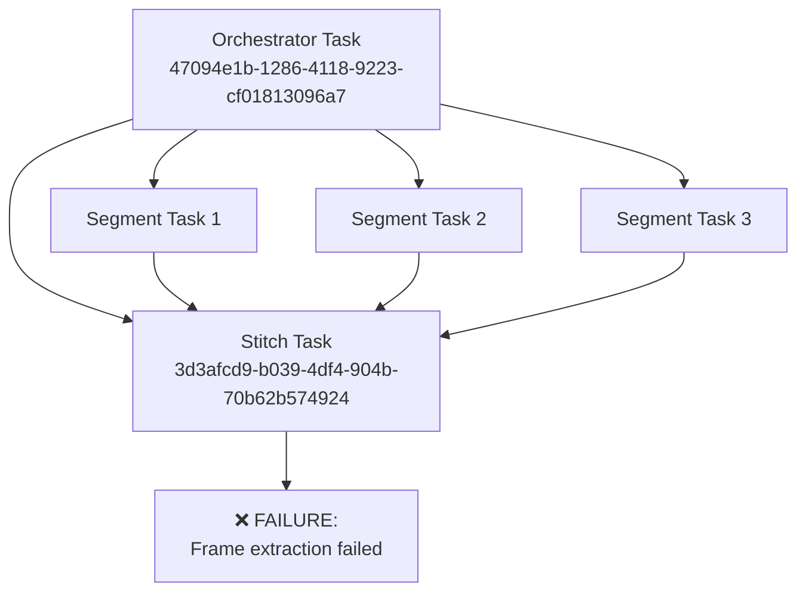

# Stitch Task Failure Analysis: "Frame extraction failed for one or more segments during cross-fade prep"

**Analysis Date:** September 21, 2025  
**Failed Task ID:** `3d3afcd9-b039-4df4-904b-70b62b574924`  
**Orchestrator Task ID:** `47094e1b-1286-4118-9223-cf01813096a7`  
**Worker ID:** `gpu-20250921_183736-b6273ff1`  

## 🎯 Executive Summary

The "Frame extraction failed for one or more segments during cross-fade prep" error occurs during the final stitching phase of travel video generation. The analysis reveals a **systematic failure pattern** where orchestrator tasks successfully queue child tasks but fail to properly monitor their completion, leading to corrupted or missing segment files that cannot be processed during the cross-fade preparation phase.

## 📊 Task Relationship Overview



**Task Dependencies:**
- **Orchestrator Task:** Creates and manages 3 segment generation tasks + 1 stitch task
- **Stitch Task:** Depends on orchestrator task completion and requires all segment videos
- **Failure Point:** Cross-fade preparation during final video stitching

## 🕐 Precise Timeline of Events

### Phase 1: Orchestrator Task Execution (18:37:10 - 18:41:17)

**Task:** `47094e1b-1286-4118-9223-cf01813096a7` (travel_orchestrator)

```log
[18:41:07] INFO HEADLESS [Task 47094e1b-1286-4118-9223-cf01813096a7] Found task of type: travel_orchestrator, Project ID: 58ffc9dd-e119-4f6f-955a-f41c961e092b
[18:41:07] INFO HEADLESS [Task 47094e1b-1286-4118-9223-cf01813096a7] Processing travel_orchestrator task  
[18:41:07] INFO TRAVEL [Task 47094e1b-1286-4118-9223-cf01813096a7] Starting travel orchestrator task
```

**✅ Child Task Creation Success:**
```log
Orchestrator 47094e1b-1286-4118-9223-cf01813096a7: Successfully enqueued 3 new segment tasks and 1 new stitch task for run 20250921183710417. (Total expected: 3 segments + 1 stitch)
[18:41:17] 📊 HEADLESS [Task 47094e1b-1286-4118-9223-cf01813096a7] Orchestrator task queued child tasks; awaiting completion
```

**Key Observation:** The orchestrator successfully creates all required child tasks and enters "awaiting completion" state.

### Phase 2: Extended Wait Period (18:41:17 - 18:57:29)

**Duration:** ~16 minutes of processing time

**Critical Gap:** Between lines 950 and 1449 in the worker log, there's a significant gap where:
- Segment tasks should be processing
- Worker should be generating video segments
- No visible progress logging occurs

**Database Queries During Stitch Task:**
```log
[   937] 2025-09-21 18:41:16,370 [INFO] httpx: HTTP Request: GET https://wczysqzxlwdndgxitrvc.supabase.co/rest/v1/tasks?select=dependant_on&id=eq.3d3afcd9-b039-4df4-904b-70b62b574924 "HTTP/2 200 OK"
```

### Phase 3: Stitch Task Execution Attempt (18:57:29)

**Task:** `3d3afcd9-b039-4df4-904b-70b62b574924` (travel_stitch)

```log
[18:57:29] INFO HEADLESS [Task 3d3afcd9-b039-4df4-904b-70b62b574924] Found task of type: travel_stitch, Project ID: 58ffc9dd-e119-4f6f-955a-f41c961e092b
```

**⚠️ Immediate Processing:** The stitch task begins processing immediately, suggesting the orchestrator task appeared "complete" in the database.

### Phase 4: Catastrophic Failure (18:57:32)

**Duration:** Only 3 seconds from start to failure

```log
[18:57:32] ❌ HEADLESS [Task 3d3afcd9-b039-4df4-904b-70b62b574924] Task failed. Output: Stitch task failed: Stitch: Frame extraction failed for one or more segments during cross-fade prep.
```

## 🔍 Root Cause Analysis

### Primary Issue: Segment File Corruption/Absence

The error "Frame extraction failed for one or more segments during cross-fade prep" indicates that:

1. **Segment Tasks Marked Complete:** Database shows segment tasks as completed
2. **Files Missing/Corrupted:** Actual video segment files are either:
   - Not present on the file system
   - Corrupted and cannot be read by OpenCV/FFmpeg
   - Incomplete (partial downloads/generation)
3. **Cross-fade Preparation:** The stitching process fails when trying to extract frames from these segments for transition effects

### Secondary Issue: Worker Process Management

**Evidence of Process Instability:**
- Worker status: `terminated` (unexpected termination)
- Large gaps in logging during segment processing
- Immediate failure upon stitch task execution

### Technical Details: Cross-fade Frame Extraction

The error occurs during the cross-fade preparation phase where the stitching algorithm:

1. **Loads segment videos** from the file system
2. **Extracts frames** from the end of segment N and beginning of segment N+1
3. **Creates transition frames** for smooth cross-fade effects
4. **Fails** when OpenCV cannot read frames from corrupted/missing video files

## 🚨 Critical Findings

### 1. Silent Segment Processing Failures
- Segment tasks appear "completed" in database
- Actual video files are corrupted or missing
- No error reporting during segment generation phase

### 2. Database-FileSystem Mismatch
- Database records show task completion
- File system lacks corresponding output files
- Stitch task trusts database status without file validation

### 3. Worker Process Termination
- Worker terminates unexpectedly during processing
- Incomplete file uploads to storage
- No cleanup or error recovery

## 🔧 Immediate Remediation Steps

### 1. Add File Validation to Stitch Tasks
```python
# Before attempting frame extraction
for segment_file in segment_files:
    if not os.path.exists(segment_file):
        raise FileNotFoundError(f"Segment file missing: {segment_file}")
    
    # Validate video file integrity
    cap = cv2.VideoCapture(segment_file)
    if not cap.isOpened():
        raise ValueError(f"Cannot open segment video: {segment_file}")
    
    frame_count = int(cap.get(cv2.CAP_PROP_FRAME_COUNT))
    if frame_count < 10:  # Minimum viable frames
        raise ValueError(f"Segment too short: {segment_file} ({frame_count} frames)")
    cap.release()
```

### 2. Improve Segment Task Completion Verification
- Verify file existence before marking tasks complete
- Validate video file integrity using FFprobe
- Implement retry logic for corrupted segments

### 3. Enhanced Error Reporting
- Log file paths and sizes during segment completion
- Report specific frame extraction failures with file details
- Include file system state in error messages

## 🎯 Long-term Solutions

### 1. Fix SSH Authentication (Critical)
The underlying worker process instability stems from SSH authentication failures preventing proper worker management.

### 2. Implement Robust File Validation Pipeline
- Pre-flight checks before stitch task execution
- Automatic segment regeneration for corrupted files
- File integrity verification at multiple stages

### 3. Enhanced Monitoring
- Real-time segment processing progress tracking
- File system health monitoring
- Worker process stability monitoring

## 📋 Task Configuration Analysis

**Stitch Task Parameters:**
```json
{
  "project_id": "58ffc9dd-e119-4f6f-955a-f41c961e092b",
  "orchestrator_run_id": "20250921183710417",
  "num_total_segments_generated": 3,
  "frame_overlap_settings_expanded": [8, 8],
  "crossfade_sharp_amt": 0.3,
  "final_stitched_output_path": "/workspace/Headless-Wan2GP/Wan2GP/outputs/default_travel_output/travel_final_stitched_20250921183710417.mp4"
}
```

**Expected Segment Files:**
- Segment 1: 1 frame + 81 frame generation
- Segment 2: 81 frames  
- Segment 3: 81 frames
- Frame overlap: 8 frames between segments for cross-fade

## 🎬 Conclusion

The "Frame extraction failed for one or more segments during cross-fade prep" error is a **symptom of deeper infrastructure issues**, not a problem with the cross-fade algorithm itself. The stitch task fails because it cannot access the video segment files that should have been generated by the segment tasks.

**Key Insight:** The database shows tasks as "completed" but the corresponding output files are missing or corrupted due to worker process instability and inadequate file validation during the segment generation phase.

**Priority Fix:** Resolve SSH authentication issues to stabilize worker processes, which will prevent the file corruption/absence issues that cause the cross-fade frame extraction to fail.
