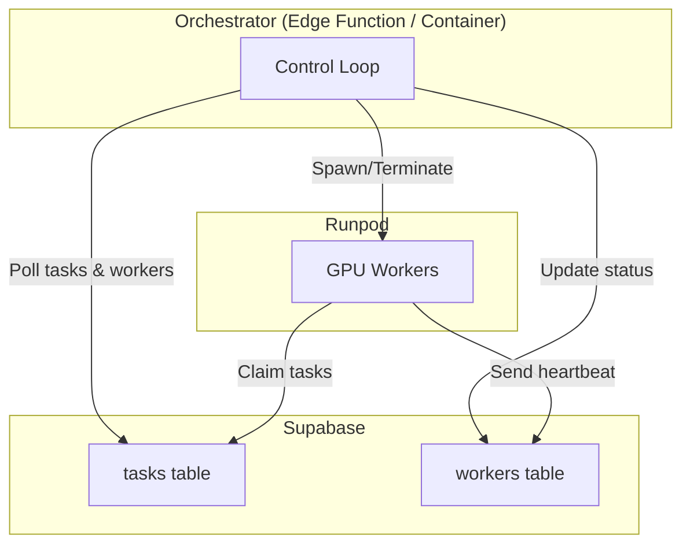

# Runpod GPU Worker Orchestrator – Execution Plan

---

## 1 . Goal
Build a lightweight service that automatically **spawns, monitors, and tears down Runpod GPU workers** based on demand tracked in Supabase tables.

- **Input source:** `tasks` table in Supabase
- **Worker registry:** `workers` table in Supabase (authoritative list of active pods)
- **Compute backend:** [Runpod](https://www.runpod.io/) GPU instances
- **Heartbeat & health:** timestamps in both tables
- **Race condition prevention:** Optimistic worker registration prevents duplicate spawning by creating database rows before API calls

---

## 2 . High-Level Architecture


**Key flows:**
- Orchestrator polls every 30s, decides scaling based on queue depth & worker health
- Workers pull tasks atomically, report heartbeat/VRAM metrics
- All state lives in Supabase (single source of truth)

---

## 2 . Finalized Design Decisions
1. **Task assignment:** Workers self-orchestrate and **pull** their own tasks.
2. **Instance type:** Single GPU flavour; `instance_type` will be set from env and remains constant.
3. **Budget ceiling:** None for MVP; cost controls handled manually.
4. **Back-off / retries:** Delegated to worker implementation.
5. **Worker image:** Docker image already stored on Runpod Storage; startup script must `cd` to storage mount and execute provided activation commands.
6. **Per-GPU concurrency:** Exactly **one task at a time**.
7. **Geo/regional constraints:** None.
8. **Scale-down policy:** **Graceful finish** – allow current task to complete before termination.
9. **Staging environment:** Not required; deploy straight to production.
10. **Monitoring:** Keep minimal; rely on the Observability view added in §9.

---

## Implementation Roadmap

### 1. Environment & Schema
- [ ] **Supabase setup**: Create project, store service-role key securely
- [x] **Database schema**: Create `workers` & `tasks` tables with enums, foreign keys, and indexes (status, heartbeat, created_at)
- [ ] **Runpod setup (API key)**: Create account and generate API key

### 2. Database Logic & Views
- [x] **Atomic task claiming**: Create `claim_task` RPC function with FOR UPDATE SKIP LOCKED
- [x] **Monitoring views**: SQL views for queue depth, active workers, recent errors

### 3. Worker Container (MVP)
- [x] **Worker script**: Minimal polling loop, atomic claiming, heartbeat updates
- [x] **Local run script**: Allow running worker locally against Supabase for fast feedback
- [x] **Containerization (stub)**: GPU-enabled Dockerfile that runs the minimal worker

### 4. Orchestrator Core (MVP)
- [x] **Project scaffold**: Initialize project with .env, Supabase client, Runpod HTTP client
- [x] **Database helpers**: `get_tasks`, `get_workers`, `update_worker_status`, etc.
- [x] **Runpod spawn/terminate wrappers**: CLI-friendly scripts for manual smoke tests
- [x] **Happy-path control loop**: Scale-up on queued tasks, promote `spawning` → `active`

### 5. Control Loop Enhancements
- [ ] **Health checks**: Heartbeat expiry, stuck tasks, VRAM metrics
- [ ] **Scale-down / graceful termination**: Idle detection, terminating status, timeout handling
- [ ] **Error handling**: `mark_worker_error` paths, auto-cleanup of failed pods

### 6. Runpod Integration Tests & Smoke Scripts
- [x] **CLI scripts**: `spawn_gpu`, `terminate_gpu` for manual testing
- [ ] **Integration tests**: Validate Runpod API interactions with stubs/mocking

### 7. Testing Suite
- [ ] **Unit tests**: Database helpers, scaling calculations
- [ ] **Integration tests**: Supabase RPC, concurrent orchestrator runs
- [ ] **End-to-end tests**: Queue → spawn → process → scale
- [ ] **Load & chaos**: High-queue scenarios, failure modes

### 8. Deployment & Operations
- [ ] **Deploy orchestrator**: Option A Edge Function + pg_cron, Option B container scheduler
- [ ] **Operational docs & runbooks**: Stuck workers, manual interventions, troubleshooting
- [ ] **Basic structured logging**: JSON logs, Supabase insert

### 9. Observability & Cost Tracking
- [x] **Monitoring dashboard**: Queue depth, worker states, errors
- [x] **Cost estimates**: Runtime × GPU pricing rough calculation

### 10. Security Hardening
- [ ] **RLS policies**: Secure worker/task access
- [ ] **Secret management**: Move API keys to secret manager
- [ ] **Permissions review**

---

## 4 . Data Model Details
### 4.1 `workers` table
| Column | Type | Description |
|--------|------|-------------|
| id | text (PK) | Unique worker ID, matches Runpod name |
| instance_type | text | GPU type (e.g., `runpod_A400`) |
| created_at | timestamptz | Worker creation time |
| last_heartbeat | timestamptz | Last health check from worker |
| status | enum | `spawning`, `active`, `terminating`, `error`, `terminated` |
| metadata | jsonb | `{runpod_id, ip, vram_total_mb, vram_used_mb, vram_timestamp, auto_promoted}` |

**Worker Status Lifecycle:**
- `spawning` → Initial state when orchestrator creates a new GPU instance
- `spawning` → `active`: When orchestrator detects worker has started processing tasks
- `spawning` → `error`: If worker fails to start processing tasks within `SPAWNING_TIMEOUT_SEC` (5 min)
- `active` → `terminating`: When marked for graceful shutdown (idle or scale-down)
- `active` → `error`: On health check failures (no heartbeat, stuck task, VRAM issues)
- `terminating` → `terminated`: After graceful shutdown completes or timeout
- `error` → `terminated`: After cleanup/termination of failed worker

### 4.2 `tasks` table (relevant columns)
| Column | Type | Description |
|--------|------|-------------|
| id | uuid | Task identifier |
| status | enum | `Queued`, `Running`, `Complete`, `Error`, `Failed` |
| attempts | int | Incremented on each failure; orchestrator marks `Failed` when attempts ≥ 3 |
| worker_id | text (FK) | Assigned worker (null if queued) |
| generation_started_at | timestamptz | When processing began |
| generation_processed_at | timestamptz | When processing completed |

**Database Indexes:** Add indexes as needed on frequently queried columns (`status`, `worker_id`, `created_at`, `last_heartbeat`) to optimize orchestrator polling performance.

---

## 5 . Environment Variables (`.env`)

### API Credentials
```
SUPABASE_URL=...
SUPABASE_SERVICE_ROLE_KEY=...
RUNPOD_API_KEY=...
```

### Scaling Parameters
```
MIN_ACTIVE_GPUS=2                   # Minimum GPUs to maintain
MAX_ACTIVE_GPUS=10                  # Hard limit to prevent runaway spawning
TASKS_PER_GPU_THRESHOLD=3           # Scale up when queued tasks ÷ active GPUs > this value
```

### Timeouts
```
GPU_IDLE_TIMEOUT_SEC=300            # 5 min - Idle workers are terminated for cost savings
TASK_STUCK_TIMEOUT_SEC=300          # 5 min - Task running too long = mark as error
SPAWNING_TIMEOUT_SEC=300            # 5 min - Max time in 'spawning' state
GPU_HEALTH_CHECK_TIMEOUT_SEC=120    # 2 min - VRAM metrics considered stale
```

### Shutdown Parameters
```
GRACEFUL_SHUTDOWN_TIMEOUT_SEC=600   # 10 min - Max wait for task completion before force termination
```

### Orchestrator Settings
```
ORCHESTRATOR_POLL_SEC=30            # How often orchestrator runs (used in deployment scheduling)
```

---

## 6 . Orchestrator Control-Loop Logic

### Core Functions Required
```python
# Database operations
get_tasks(status)                    # Fetch tasks by status
get_workers(status)                  # Fetch workers by status
update_worker_status(id, status)     # Update worker state
create_worker_record(id, status)     # Optimistic registration
mark_worker_error(w, reason)         # Error state with metadata

# Health checks
no_recent_tasks(w)                   # Check if worker is idle
has_running_tasks(worker_id)         # Check active tasks

# Runpod API
spawn_runpod_gpu(worker_id)          # Create GPU instance
terminate_runpod(w)                  # Terminate GPU instance
```

### Concurrency Approach
**Current Strategy:** The orchestrator relies on database-level protections rather than explicit distributed locking:
- **Optimistic registration:** Workers are created as DB rows before Runpod API calls, preventing duplicate spawning through PK constraints
- **Atomic operations:** Task claiming uses `FOR UPDATE SKIP LOCKED`, worker status updates are transactional
- **Self-correcting:** Fresh DB queries each run allow natural convergence if overlaps occur
- **Trade-off:** Accepts minor risk of concurrent runs (e.g., temporary over-scaling) in favor of simplicity and potential responsiveness to new data
- **Monitoring:** Watch for duplicate actions in logs; consider distributed locking if issues arise at scale

### Main Control Loop
```python
def orchestrator_run():  # Single execution per schedule
    tasks = get_tasks(status=['Queued','Running'])
    workers = get_workers(status=['spawning', 'active'])
    
    # 1. SPAWNING WORKERS: Promote or timeout
    for w in spawning_workers:
        if has_processed_tasks(w):
            update_worker_status(w.id, 'active')
        elif age(w) > SPAWNING_TIMEOUT_SEC:
            mark_worker_error(w, 'Spawning timeout')

    # 2. HEALTH CHECKS: Heartbeat, stuck tasks, GPU metrics
    for w in active_workers:
        if heartbeat_expired(w) or has_stuck_task(w) or vram_unhealthy(w):
            mark_worker_error(w, reason)
            terminate_runpod(w)

    # 3. REASSIGN: Orphaned tasks from failed workers
    reset_orphaned_tasks(failed_worker_ids)
    
    # 4. SCALE DOWN: Idle workers above minimum
    idle_workers = [w for w in active_workers if is_idle(w)]
    for w in idle_workers[:max(0, total_workers - MIN_ACTIVE_GPUS)]:
        update_worker_status(w.id, 'terminating')
    
    # Handle graceful shutdown for terminating workers
    for w in terminating_workers:
        if not has_running_tasks(w.id) or grace_period_expired(w):
            terminate_runpod(w)
            update_worker_status(w.id, 'terminated')
    
    # 5. SCALE UP: Queue depth exceeds capacity
    queued_count = count_available_tasks_via_edge_function(include_active=False)
    active_count = count_active_workers()
    
    if should_scale_up(queued_count, active_count):
        to_spawn = calculate_workers_needed(queued_count, active_count)
        # Each worker id is globally unique to avoid Runpod name collisions
        # Format: gpu-<timestamp>-<uuid4>
        for _ in range(to_spawn):
            worker_id = generate_worker_id()
            create_worker_record(worker_id, 'spawning')  # Optimistic registration
            try:
                spawn_runpod_gpu(worker_id)
            except Exception as e:
                mark_worker_error(worker_id, f'Spawn failed: {e}')
```

---

## 7 . Runpod Integration
**API endpoints:**
- Create GPU: `POST /user/cluster/gpu/pods` (name, container image, env vars)
- Terminate: `DELETE /user/gpu/pod/{podId}`

**Worker responsibilities:**
- Poll and claim tasks atomically (see task claiming below)
- Send heartbeat with GPU metrics every 20s
- Gracefully shutdown on 'terminating' status

### 7.1 Task Claiming Logic
```sql
-- Atomic task claiming prevents race conditions
UPDATE tasks 
SET status = 'Running', worker_id = $1, generation_started_at = NOW()
WHERE id = (
    SELECT id FROM tasks 
    WHERE status = 'Queued' AND worker_id IS NULL
    ORDER BY created_at ASC
    LIMIT 1
    FOR UPDATE SKIP LOCKED  -- Key: concurrent workers don't block
)
RETURNING *;
```

**Worker implementation:**
```python
async def claim_next_task(worker_id):
    # First check if worker is marked for termination
    worker = await get_worker_status(worker_id)
    if worker['status'] == 'terminating':
        return None  # Don't accept new tasks when terminating
    
    result = await supabase.rpc('claim_task', {'worker_id': worker_id})
    if result.data:
        return result.data[0]  # Successfully claimed task
    return None  # No tasks available

# Worker main loop
while running:
    task = await claim_next_task(worker_id)
    if task:
        await process_task(task)
        await mark_task_complete(task['id'])
    else:
        # Check if we should shut down
        worker = await get_worker_status(worker_id)
        if worker['status'] == 'terminating':
            print(f"Worker {worker_id} shutting down gracefully")
            running = False
        else:
            await asyncio.sleep(5)  # Wait before polling again
```

### 7.2 Failure-count & Dead-letter Logic
```sql
-- Called by worker/orchestrator when a task run fails
UPDATE tasks
SET attempts = attempts + 1,
    status   = CASE WHEN attempts + 1 >= 3 THEN 'Failed' ELSE 'Error' END,
    generation_processed_at = NOW()
WHERE id = $1;
```

**Worker error handler (pseudo-python):**
```python
try:
    await process_task(task)
    await mark_task_complete(task['id'])
except Exception as e:
    log.error(f"task {task['id']} failed: {e}")
    await supabase.rpc('mark_task_failed', {'task_id': task['id']})
```

Once a task reaches 3 attempts (configurable), the orchestrator ignores it unless manual intervention resets the counter, effectively acting as a dead-letter queue.

---

## 8 . Deployment Options
**Option A: Supabase Edge Function (recommended)**
- Stateless handler, single execution per invocation  
- Schedule with pg_cron: `SELECT cron.schedule('orchestrator', '*/30 * * * * *', $$ SELECT net.http_post('your-edge-function-url') $$)`  <!-- every 30 s, pg_cron supports second-level field -->
- Runtime limit: 30s (sufficient for orchestrator logic)

**Option B: Container/Kubernetes**
- Deploy as cron job or continuous service
- More flexibility but higher operational overhead

---

## 9 . Observability
Create a monitoring SQL view showing:
- Queue depth & processing rate
- Active/error/terminated worker counts
- Recent failures and termination reasons
- Cost estimates based on runtime

---

## 10 . Security Considerations
- Store service keys in **secure secret manager** (e.g., Supabase Vault, AWS Secrets Manager).
- Restrict Supabase service role key usage to orchestrator environment only.
- Principle-of-least-privilege Runpod API key.

---

*Authored: 2025-07-22* 