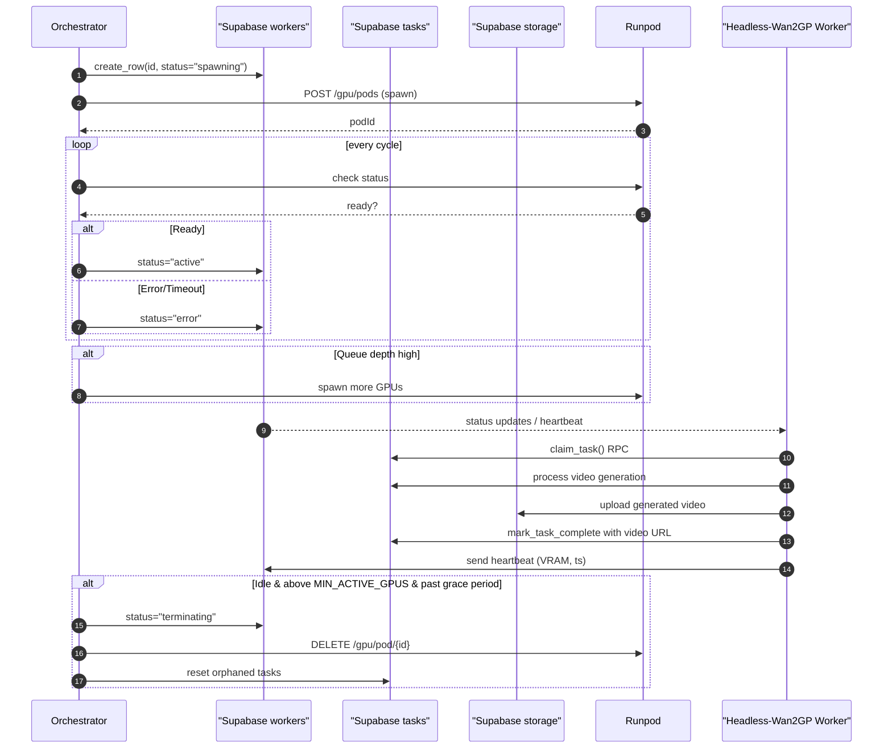

# Headless_WGP_Orchestrator: Developer Onboarding Guide

## Quick Start
```bash
python -m gpu_orchestrator.main continuous
```

> **How to Use This Guide**  
> • Skim the Tech Stack & Directory tables below to orient yourself.  
> • Need deep-dive implementation details? Follow the links to sub-docs in `structure_docs/` (one file per topic).  
> • This guide reflects **current** architecture – not historical changes. For git history, explore commits & PRs.  
> • When in doubt the source of truth is always the code and the SQL schema – this guide just points you in the right direction.

> **When to Update This Guide & Sub-Docs**  
> • Create/rename/delete any top-level directory, critical script, or deployment file.  
> • Change database schema, RPC functions, or environment variables.  
> • Add or refactor orchestration logic (scaling rules, health checks, Runpod API wrapper).  
> • Introduce a new worker type, task type, or compute backend.  
> • Anything that would confuse a new dev skimming this file.

> **Who This Guide Is For**  
> • 👨‍💻 New maintainers coming up to speed  
> • 🤖 AI coding assistants that need a high-level mental model

---

## Table of Contents
1. [Tech Stack & Ports](#1-tech-stack--ports)
2. [Directory Structure](#2-directory-structure)
3. [Core Components](#3-core-components)
   * 3.1 [Orchestrator](#31-orchestrator-orchestrator)
   * 3.2 [GPU Worker](#32-gpu-worker-headless-wan2gp)
   * 3.3 [Scripts & Tooling](#33-scripts--tooling-scripts)
   * 3.4 [SQL Migrations](#34-sql-migrations-sql)
   * 3.5 [Deployment Artifacts](#35-deployment-artifacts-deployment)
4. [Task & Worker Lifecycle](#4-task--worker-lifecycle)
5. [Environment Variables](#5-environment-variables)
6. [Supported Task Types](#6-supported-task-types)
7. [Development Workflow](#7-development-workflow)
8. [Quick Reference: Sub-Documentation](#8-quick-reference-sub-documentation)

---

## 1. Tech Stack & Ports

| Layer | Technology | Purpose |
|-------|------------|---------|
| **Runtime** | Python 3.10+ | Core language for orchestrator & worker |
| **Database** | Supabase (PostgreSQL + RPC) | Task queue, worker registry, monitoring views |
| **Compute** | Runpod GPU Instances | On-demand GPU workers |
| **Container** | Docker | Packaging for orchestrator & GPU worker |
| **Infra-as-Code** | YAML / JSON | ECS task def, K8s CronJob, Cloud-Run spec |
| **CI/Testing** | PyTest, Black, MyPy | Quality gates & linting |

The orchestrator is **headless** – it exposes no HTTP server by default. All scheduling happens via cron / Cloud Scheduler / K8s CronJob. Therefore no local ports are opened in normal operation.

---

## 2. Directory Structure

| Path | Purpose | Key Files |
|------|---------|-----------|
| **`gpu_orchestrator/`** | GPU orchestration logic | `main.py`, `control_loop.py`, `database.py`, `runpod_client.py`, `logging_config.py` |
| **`scripts/`** | CLI utilities & smoke tests | `spawn_gpu.py`, `shutdown_all_workers.py`, `dashboard.py`, `test_supabase.py` |
| **`sql/`** | Versioned SQL migrations & views | `*_add_missing_columns.sql`, `*_create_rpc_functions_existing.sql`, ... |
| **`deployment/`** | Container & infra configs | `Dockerfile`, `docker-compose.yml`, `aws-ecs-task-definition.json`, `kubernetes-cronjob.yaml`, `google-cloud-run.yaml` |
| **`tests/`** | PyTest suite placeholders | `test_*.py` |
| **Docs & Plans** | Architecture & guides | `orchestrator_plan.md`, `DEPLOYMENT_GUIDE.md`, `user_checklist.md`, **this file** |

---

## 3. Core Components

### 3.1 Orchestrator (`/orchestrator`)

The orchestration service is intended to be triggered **once every N seconds** (default 30) by an external scheduler. Entry points:

* **`main.py`** – CLI wrapper. Accepts `single` (one-shot) or `continuous` (loop forever) modes.
* **`control_loop.py`** – Heart of the system. Contains class `OrchestratorControlLoop` with method `run_single_cycle()`. Responsibilities:
  1. Fetch current **task** and **worker** state from Supabase.
  2. Promote or fail *spawning* workers.
  3. Run health checks on *active* workers (heartbeat, stuck tasks, VRAM metrics).
  4. Reassign orphaned tasks from failed workers.
  5. Scale **down** idle GPUs above `MIN_ACTIVE_GPUS` (respects grace period).
  6. Handle graceful shutdown for *terminating* workers.
  7. Scale **up** by optimistic DB registration → Runpod API → status polling.

* **`database.py`** – Typed wrapper around Supabase RPC & table queries. Exposes roughly:
  - `get_tasks()`, `count_available_tasks_via_edge_function()`, `claim_task()`, `mark_task_complete()`, `mark_task_failed()`
  - `get_workers()`, `create_worker_record()`, `update_worker_status()`, `mark_worker_error()`
  - `reset_orphaned_tasks()` and helper analytics functions.

* **`runpod_client.py`** – Minimal HTTP client for Runpod REST API. Key helpers: `spawn_runpod_gpu()`, `terminate_runpod_gpu()`, `check_and_initialize_worker()`, `start_worker_process()`.

* **`logging_config.py`** – JSON-style structured logging; shared by Headless-Wan2GP & orchestrator.

### 3.2 GPU Worker ([Headless-Wan2GP](https://github.com/peteromallet/Headless-Wan2GP))

The actual GPU worker is **[Headless-Wan2GP](https://github.com/peteromallet/Headless-Wan2GP)** - a headless video generation system that runs inside each Runpod container.

* **`worker.py`** – Main worker process that polls Supabase for video generation tasks:
  1. `claim_task()` via Supabase RPC `func_claim_available_task`.
  2. Process video generation using Wan2GP models.
  3. Upload generated videos to Supabase storage bucket.
  4. `mark_task_complete()` or `mark_task_failed()`.
  5. Send heartbeat every 20s with optional VRAM metrics.
  6. Exit gracefully when marked for termination.

* **Wan2GP integration** – Uses the Wan2GP model for high-quality video generation
* **Dual storage modes** – Can use local SQLite or Supabase (orchestrator uses Supabase mode)
* **Auto-upload** – Saves generated videos to Supabase storage bucket with public URLs

The worker runs inside Runpod containers with:
```bash
python worker.py --main-output-dir ./outputs
```

### 3.3 Scripts & Tooling (`/scripts`)

| Script | Purpose |
|--------|---------|
| `setup_database.py` | Bootstrap tables, enums, RPC functions in fresh Supabase project |
| `apply_sql_migrations.py` | Run all SQL files in `/sql` in order |
| `spawn_gpu.py` / `shutdown_all_workers.py` | Manual Runpod control for smoke-tests |
| `dashboard.py` | CLI dashboard with real-time queue depth & worker status |
| `test_runpod.py`, `test_supabase.py` | Connectivity / auth sanity checks |
| `analyze_recent_tasks.py` | **[Debug]** Analyze most recent N tasks regardless of status with timing and distribution patterns |
| `analyze_task_failures.py` | **[Debug]** Comprehensive failure analysis combining database queries with detailed log analysis |
| `query_failed_tasks.py` | **[Debug]** Query and analyze patterns in recently failed tasks |
| `fetch_worker_logs.py` | **[Debug]** Intelligently fetch comprehensive worker logs with real-time progress monitoring, timing analysis, and adaptive method selection |
| `fetch_task_logs.py` | **[Debug]** Extract task-specific timeline from orchestrator.log with context |
| `show_termination_config.py` | Display current worker termination timing configuration and logic |

**Application Debugging (Task Failures, Worker Crashes, Log Analysis):**
- `query_logs.py` - Query centralized `system_logs` table by worker/task/time
- `view_worker_diagnostics.py` - View diagnostics collected when workers fail (VRAM, pod status, tasks)
- All worker and orchestrator logs stored in `system_logs` with 48hr retention
- Example: `python query_logs.py --worker-timeline <worker_id>`

**Infrastructure Debugging (SSH, Deployment, Network Issues):**
- `fetch_worker_logs.py` - Git status, system logs, SSH connectivity testing
- `comprehensive_diagnostics.py` - Environment audit, network tests, deployment verification
- Use these for pod provisioning issues, NOT for application-level errors

Scripts are **idempotent** and safe to run locally – they rely on env-vars for credentials.

### 3.4 SQL Migrations (`/sql`)

Strictly timestamp-versioned, applied by `apply_sql_migrations.py` or any external migration tool. Includes:

* Table alterations adding missing columns.
* Creation of RPC helpers (`func_claim_available_task`, `func_mark_task_complete`, etc.).
* Monitoring views powering the CLI dashboard.

### 3.5 Deployment Artifacts (`/deployment`)

Multiple deployment flavours – pick one and ignore the rest:

* **Docker Compose** – Simple local stack (`docker-compose.yml`).
* **AWS ECS Fargate** – `aws-ecs-task-definition.json` with EventBridge schedule.
* **Kubernetes CronJob** – `kubernetes-cronjob.yaml` (includes continuous Deployment variant).
* **Google Cloud Run** – `google-cloud-run.yaml` + Cloud Scheduler job.

All leverage the common **`Dockerfile`** in this folder.

---

## 4. Task & Worker Lifecycle



For a prose explanation, see `orchestrator_plan.md` § 6.

---

## 5. Environment Variables

All keys live in `.env` (never commit real secrets). Critical ones:

| Category | Variable | Default | Description |
|----------|----------|---------|-------------|
| **Supabase** | `SUPABASE_URL` | – | Project URL |
|  | `SUPABASE_SERVICE_ROLE_KEY` | – | Service role JWT |
| **Runpod** | `RUNPOD_API_KEY` | – | Personal API key |
| **Worker Config** | `DB_TYPE` | `supabase` | Tells Headless-Wan2GP to use Supabase mode |
|  | `SUPABASE_VIDEO_BUCKET` | `videos` | Storage bucket for generated videos |
|  | `POSTGRES_TABLE_NAME` | `tasks` | Table name (optional, defaults to "tasks") |
| **Scaling** | `MIN_ACTIVE_GPUS` | `2` | Floor for active GPUs (set to 0 for aggressive cost savings) |
|  | `MAX_ACTIVE_GPUS` | `10` | Hard ceiling |
|  | `TASKS_PER_GPU_THRESHOLD` | `3` | Trigger scaling when `Queued/Active > threshold` |
|  | `MACHINES_TO_KEEP_IDLE` | `0` | Number of idle GPUs to keep running for immediate task pickup |
| **Timeouts (sec)** | `GPU_IDLE_TIMEOUT_SEC` | `300` | Heartbeat expiry for busy queue |
|  | `TASK_STUCK_TIMEOUT_SEC` | `300` | Detect stuck tasks |
|  | `SPAWNING_TIMEOUT_SEC` | `300` | Fail slow spawns |
|  | `GRACEFUL_SHUTDOWN_TIMEOUT_SEC` | `600` | Give terminating worker this long to finish task |
|  | `WORKER_GRACE_PERIOD_SEC` | `120` | Grace period after promotion before idle checks |
| **Misc** | `ORCHESTRATOR_POLL_SEC` | `30` | Interval for continuous mode |

---

## 6. Supported Task Types

The orchestrator works with video generation tasks processed by [Headless-Wan2GP](https://github.com/peteromallet/Headless-Wan2GP):

* **Video Generation** – Text-to-video using Wan2GP models
* **Frame Interpolation** – Smooth video transitions and upscaling  
* **Custom Prompts** – User-defined generation parameters with LoRA support
* **Batch Processing** – Multiple video generations from prompt lists

### Required Supabase Setup

For Headless-Wan2GP integration, you need:

1. **Storage Bucket** – Create a public bucket (e.g., `videos`) for generated video files
2. **Database Schema** – The same `tasks` table and RPC functions used by the orchestrator
3. **Environment Variables** – Configure Headless-Wan2GP workers with Supabase credentials

Task schema and processing details: see [`task_processing.md`](structure_docs/task_processing.md)

---

## 7. Development Workflow

1. **Bootstrap**
   ```bash
   cp env.example .env      # fill in creds
   pip install -r requirements.txt
   python scripts/setup_database.py   # creates tables & RPC fns
   python -m gpu_orchestrator.main single # dry-run on local machine
   ```
2. **Run tests & linters**
   ```bash
   pytest
   black . && isort .
   mypy orchestrator/
   ```
3. **Docker smoke test**
   ```bash
   docker build -f deployment/Dockerfile -t orchestrator:dev .
   docker run --env-file .env orchestrator:dev single
   ```
4. **Debugging** – increase logging level via `LOG_LEVEL=DEBUG` in env or run scripts like `dashboard.py`.

---

## 8. Quick Reference: Sub-Documentation

| Topic | File | Description |
|-------|------|-------------|
| **Deployment Matrix** | [`DEPLOYMENT_GUIDE.md`](DEPLOYMENT_GUIDE.md) | Side-by-side comparison & step-by-step guides |
| **Architecture Plan** | [`orchestrator_plan.md`](orchestrator_plan.md) | Design rationale & sequence diagrams |
| **Database & RPC Details** | [`structure_docs/database_and_rpc.md`](structure_docs/database_and_rpc.md) | Schema map, RPC signatures, indices |
| **Runpod API Wrapper** | [`structure_docs/runpod_integration.md`](structure_docs/runpod_integration.md) | How `runpod_client.py` maps to HTTP calls |
| **Scaling Logic** | [`structure_docs/health_and_scaling.md`](structure_docs/health_and_scaling.md) | Formulas, thresholds, timeout strategy |
| **Task Types & Processing** | [`structure_docs/task_processing.md`](structure_docs/task_processing.md) | Video generation task schema, Headless-Wan2GP integration |
| **Debugging & Monitoring** | [`structure_docs/debug_logging.md`](structure_docs/debug_logging.md) | Log structure, dashboard CLI, progress monitoring, timing analysis for issue detection |

*(If a linked file does not yet exist, create it the first time you edit that part of the system.)*

---

<div align="center">

**🎯 Happy shipping!** – New questions? Start with `orchestrator_plan.md` and the code, then update this guide for the next dev.

</div> 