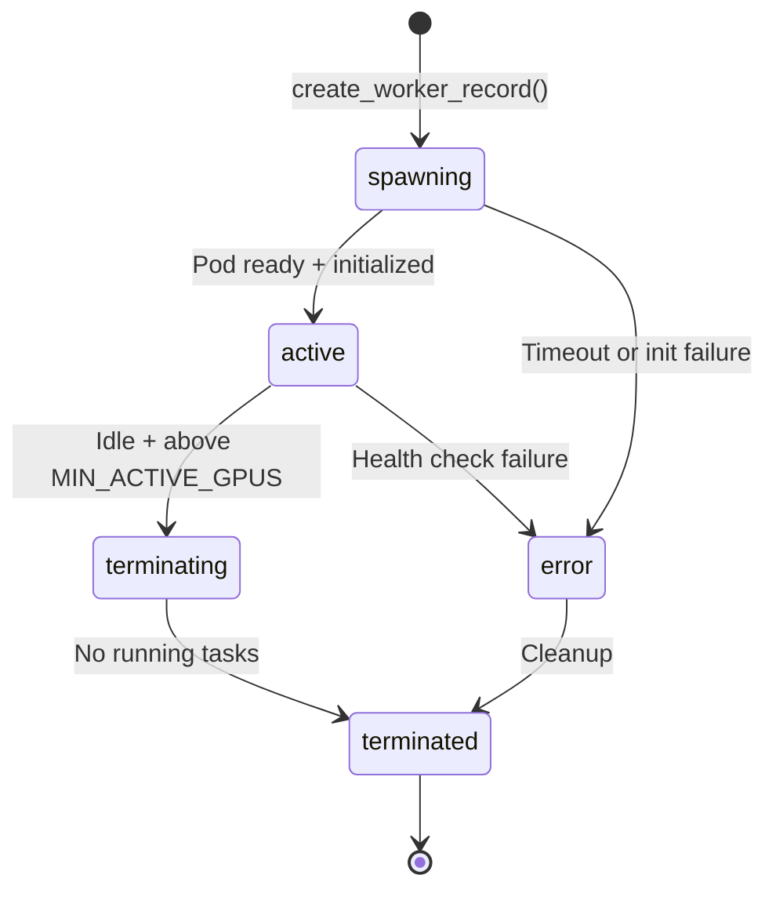

# Health Checks & Scaling Logic

This document covers how the orchestrator makes scaling decisions and monitors worker health.

## Control Loop Overview

The orchestrator runs every 30 seconds (configurable via `ORCHESTRATOR_POLL_SEC`) and executes these phases:

1. **Worker Promotion** - Move `spawning` → `active` when ready
2. **Health Checks** - Monitor `active` workers and mark failed ones as `error`
3. **Task Reassignment** - Reset orphaned tasks from failed workers
4. **Scale Down** - Terminate idle workers above minimum
5. **Scale Up** - Spawn new workers when queue depth exceeds threshold

## Environment Variable Configuration

| Variable | Default | Description | Phase |
|----------|---------|-------------|-------|
| `MIN_ACTIVE_GPUS` | `2` | Minimum workers to maintain | Scale Down |
| `MAX_ACTIVE_GPUS` | `10` | Hard ceiling to prevent runaway costs | Scale Up |
| `TASKS_PER_GPU_THRESHOLD` | `3` | Scale up when `queued_tasks / active_workers > threshold` | Scale Up |
| `GPU_IDLE_TIMEOUT_SEC` | `300` | Worker heartbeat expiry (5 min) | Health Check |
| `TASK_STUCK_TIMEOUT_SEC` | `300` | Max task processing time (5 min) | Health Check |
| `SPAWNING_TIMEOUT_SEC` | `300` | Max time in spawning state (5 min) | Promotion |
| `GRACEFUL_SHUTDOWN_TIMEOUT_SEC` | `600` | Max wait for task completion before force termination (10 min) | Scale Down |

## Worker State Transitions



## Scaling Logic

### Scale Up Decision
**Trigger:** `should_scale_up(queued_count, effective_capacity)`

```python
def should_scale_up(queued_count: int, active_count: int) -> bool:
    if active_count == 0:
        return queued_count > 0  # Always scale if tasks but no workers
    
    tasks_per_worker = queued_count / active_count
    return tasks_per_worker > TASKS_PER_GPU_THRESHOLD
```

**Capacity Calculation:**
- `effective_capacity = active_workers + spawning_workers`
- Spawning workers count as capacity to prevent over-provisioning
- Respects `MAX_ACTIVE_GPUS` hard limit

**Workers Needed Formula:**
```python
def calculate_workers_needed(queued_count: int, active_count: int) -> int:
    if active_count == 0 and queued_count > 0:
        return MIN_ACTIVE_GPUS  # Meet minimum requirement
    
    # Ceiling division to avoid exceeding threshold
    ideal_workers = max(MIN_ACTIVE_GPUS, ceil(queued_count / TASKS_PER_GPU_THRESHOLD))
    return max(0, ideal_workers - active_count)
```

### Scale Down Decision
**Trigger:** `total_workers > MIN_ACTIVE_GPUS` AND worker is idle

**Idle Detection:**
```python
async def is_worker_idle(worker: Dict) -> bool:
    return not await db.has_running_tasks(worker['id'])
```

**Termination Order:**
- Only terminate workers above `MIN_ACTIVE_GPUS`
- Selects idle workers for termination
- Graceful shutdown: wait for current task completion

## Health Check Logic

### Worker Promotion (spawning → active)
Monitors spawning workers every cycle:

1. **Check Runpod Pod Status** - Must be `RUNNING` with SSH access
2. **Initialize Worker** - Verify storage mount, GPU, dependencies
3. **Start Worker Process** - Launch Headless-Wan2GP if `AUTO_START_WORKER_PROCESS=true`
4. **Timeout Handling** - Mark as `error` if spawning > `SPAWNING_TIMEOUT_SEC`

### Active Worker Health Checks
Applied to all `active` workers every cycle:

#### 1. Heartbeat Expiry
```python
if heartbeat_age > GPU_IDLE_TIMEOUT_SEC:
    if queued_count > 0:
        mark_worker_error(worker, 'Heartbeat expired with tasks queued')
    else:
        # Worker idle but healthy - no action needed
        pass
```

**Logic:**
- Only fail workers for heartbeat timeout if there are queued tasks
- Allows workers to go quiet when no work available
- Prevents unnecessary termination during low activity

#### 2. Stuck Task Detection
```python
for task in get_running_tasks_for_worker(worker_id):
    task_age = now() - task['generation_started_at']
    if task_age > TASK_STUCK_TIMEOUT_SEC:
        mark_worker_error(worker, f'Stuck task {task_id}')
```

**Triggers:**
- Task in `In Progress` state longer than timeout
- Usually indicates worker crash or infinite loop
- Immediate worker termination and task reset

#### 3. VRAM Health (Optional)
```python
if 'vram_timestamp' in metadata:
    vram_age = now() - metadata['vram_timestamp']
    if vram_age > GPU_HEALTH_CHECK_TIMEOUT_SEC:
        logger.warning(f"Stale VRAM data ({vram_age}s old)")
        # Note: This is a warning, not an error condition
```

**Features:**
- Monitors GPU memory usage metrics
- Logs warnings for stale data but doesn't fail workers
- Used for observability, not automated decisions

### Worker Error Handling
When a worker fails health checks:

1. **Mark as Error** - Update DB status to `error` with reason
2. **Terminate Pod** - Call Runpod API to stop billing
3. **Reset Tasks** - Orphaned tasks moved back to `Queued` (if attempts < 3)

**Error Reasons:**
- `"Heartbeat expired with tasks queued"`
- `"No heartbeat received with tasks queued"`
- `"Stuck task {task_id}"`
- `"Spawning timeout"`
- `"No Runpod ID"`

## Graceful Shutdown Logic

### Terminating Worker Handling
Workers marked for termination get special treatment:

```python
for worker in terminating_workers:
    if not has_running_tasks(worker_id) or grace_period_expired(worker):
        terminate_runpod(worker)
        update_worker_status(worker_id, 'terminated')
```

**Grace Period:**
- Workers can finish current task within `GRACEFUL_SHUTDOWN_TIMEOUT_SEC`
- After timeout, forced termination occurs
- Prevents workers from running indefinitely

### Task Assignment Prevention
```sql
-- In func_claim_available_task
IF EXISTS (SELECT 1 FROM workers w WHERE w.id = worker_id_param AND w.status = 'terminating') THEN
    RETURN; -- Don't assign new tasks to terminating workers
END IF;
```

Workers marked for termination won't receive new tasks but can complete existing ones.

## Optimistic Registration Pattern

To prevent race conditions when scaling up:

1. **Create DB Record First** - Worker row with `spawning` status
2. **Call Runpod API** - Create actual GPU pod
3. **Update with Pod ID** - Store Runpod metadata
4. **Monitor Status** - Poll until ready or timeout

**Benefits:**
- Primary key constraint prevents duplicate spawning
- Database is source of truth for worker count
- Failed API calls don't leave orphaned pods

## Monitoring & Observability

### Cycle Summary
Each orchestrator run returns structured JSON:

```json
{
  "timestamp": "2024-01-01T12:00:00Z",
  "actions": {
    "workers_promoted": 1,
    "workers_failed": 0,
    "workers_spawned": 2,
    "workers_terminated": 1,
    "tasks_reset": 3
  },
  "status": {
    "queued_tasks": 15,
    "spawning_workers": 2,
    "active_workers": 5,
    "terminating_workers": 1,
    "total_workers": 8
  }
}
```

### Health Status Views
Database views provide real-time monitoring:

- **`orchestrator_status`** - Queue depth, worker counts, health indicators
- **`active_workers_health`** - Per-worker health with VRAM usage
- **`worker_performance`** - Success rates, processing times, uptime

## Common Scenarios

### High Traffic Spike
1. **Queue builds up** - Many tasks in `Queued` status
2. **Scale up trigger** - `queued_tasks / active_workers > 3`
3. **Multiple spawns** - Calculate workers needed, respect MAX_ACTIVE_GPUS
4. **Gradual activation** - Workers promote to `active` as pods become ready

### Worker Failures
1. **Health check fails** - Heartbeat timeout or stuck task
2. **Immediate termination** - Pod terminated, worker marked `error`
3. **Task recovery** - Orphaned tasks reset to `Queued` for retry
4. **Replacement spawn** - Queue depth may trigger new worker

### Quiet Period
1. **Queue empties** - No `Queued` tasks remain
2. **Workers go idle** - No `In Progress` tasks
3. **Scale down** - Terminate workers above `MIN_ACTIVE_GPUS`
4. **Maintenance level** - Keep minimum workers for quick response

### Cost Control
- **Hard limit** - `MAX_ACTIVE_GPUS` prevents runaway scaling
- **Graceful shutdown** - Workers complete tasks before termination
- **Minimum guarantee** - `MIN_ACTIVE_GPUS` ensures service availability
- **Idle termination** - No work = no unnecessary costs 